<div align="center">

# SG Mobile

### Универсальный VPN-клиент для Android

**Профили, подписки, маршрутизация, мониторинг и защита от утечек в одном приложении.**


</div>

---

## О проекте

SG Mobile — Android-клиент для работы с отдельными VPN-профилями и подписками с большим количеством серверов.

Приложение объединяет несколько сетевых движков в одном интерфейсе. Пользователь может импортировать профиль или подписку, выбрать сервер, настроить маршрутизацию, подключиться и проверить фактическое состояние трафика.

Этот репозиторий является публичной витриной проекта. Здесь публикуются документация, справка, скриншоты, контрольные суммы и готовые APK-релизы. Исходный код приложения в этом репозитории не размещается.

## Основные возможности

| Область | Возможности |
|---|---|
| Профили | Импорт отдельных ссылок, конфигураций и QR-кодов |
| Подписки | Обновление, фильтры, сортировка, выбор и удаление нод |
| Протоколы | VLESS, VMess, Trojan, Hysteria2, Mieru, AnyTLS, TUIC, AWG 2.0, AWG 3.0 и AWG 3.1 |
| Маршрутизация | VPN, Direct, Block, пользовательские правила, RU White List, RU Blocked и GeoFiles |
| VPN для приложений | Весь трафик, только выбранные приложения или исключение выбранных |
| Мониторинг | Скорость, трафик сессии, графики и распределение VPN / Direct / Block |
| Защита | IPv4, IPv6, DNS policy, Always-on VPN и системный Kill Switch |
| Стабильность | Переключение Wi-Fi / LTE / 5G, восстановление соединения и настройка MTU |
| Резервная копия | Экспорт, проверка и восстановление пользовательских данных |
| Диагностика | Журнал событий, данные подключения и безопасный экспорт отчёта |
| Справка | 16 русских разделов, встроенных в приложение и доступных без интернета |

## Поддерживаемые технологии

SG Mobile использует отдельный runtime для каждого семейства протоколов:

- libXray — VLESS, VMess и Trojan;
- Hysteria2;
- sing-box — AnyTLS и TUIC;
- Mieru;
- Mihomo;
- AmneziaWG — AWG 2.0, AWG 3.0 и AWG 3.1.

Поддержка конкретного формата зависит от полноты конфигурации. Приложение проверяет обязательные параметры до запуска подключения.

## Быстрый старт

1. Откройте раздел [Releases](../../releases).
2. Скачайте APK и файл контрольных сумм из одного релиза.
3. Сравните SHA-256 скачанного APK с опубликованным значением.
4. Установите APK на Android 8.0 или новее.
5. Добавьте профиль, конфигурацию AWG или адрес подписки.
6. Разрешите Android создать VPN-подключение.
7. После подключения проверьте страницу «Статус».

До публикации первого проверенного релиза раздел Releases может быть пустым. Не скачивайте APK из комментариев, случайных зеркал или сторонних сообщений.

## Документация

- [Полная русская справка](HELP-RU.md)
- [Частые вопросы](FAQ.md)
- [Поддержка и сообщения об ошибках](SUPPORT.md)
- [История изменений](CHANGELOG.md)
- [Правила безопасной публикации отчётов](SECURITY.md)
- [Уведомления о сторонних компонентах](THIRD-PARTY-NOTICES.md)
- [Требования к скриншотам](docs/screenshots/README.md)
- [Состав публичного релиза](docs/releases/README.md)

В самом приложении пункт «Справка» находится в боковом меню между «Диагностика» и «О приложении».

## Интерфейс

Ниже используются исходные PNG **1080 × 2340** без перекодирования и уменьшения файлов. Нажмите на любой снимок, чтобы открыть полный оригинал.

<p align="center">
  <a href="docs/screenshots/01-home-disconnected.png">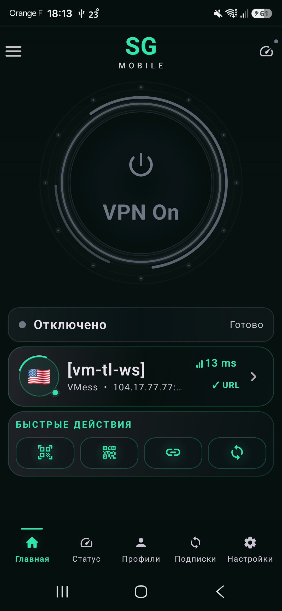</a>
  <a href="docs/screenshots/02-home-connected.png">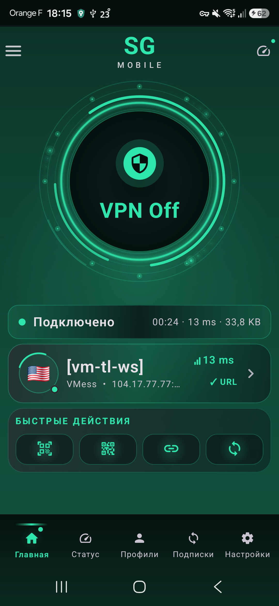</a>
  <a href="docs/screenshots/03-profiles.png">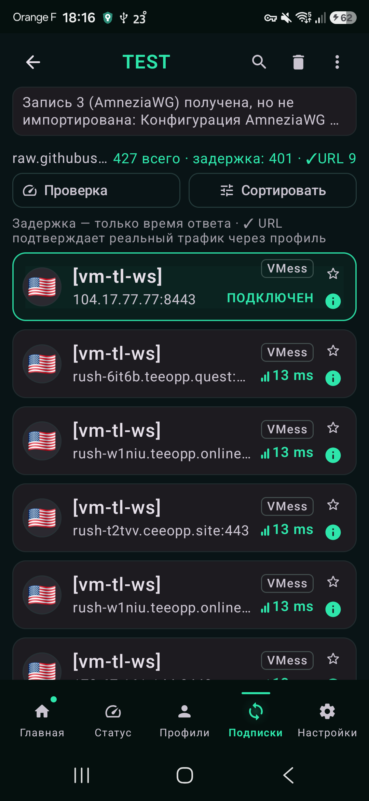</a>
  <a href="docs/screenshots/04-import-profile.png">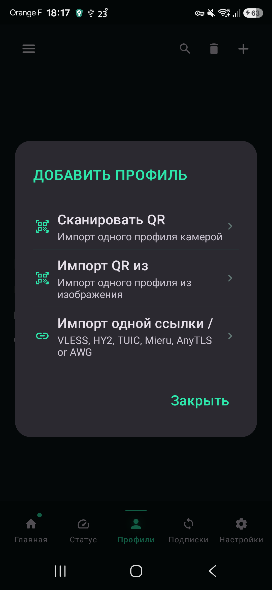</a>
</p>

<p align="center">
  <a href="docs/screenshots/05-subscriptions.png">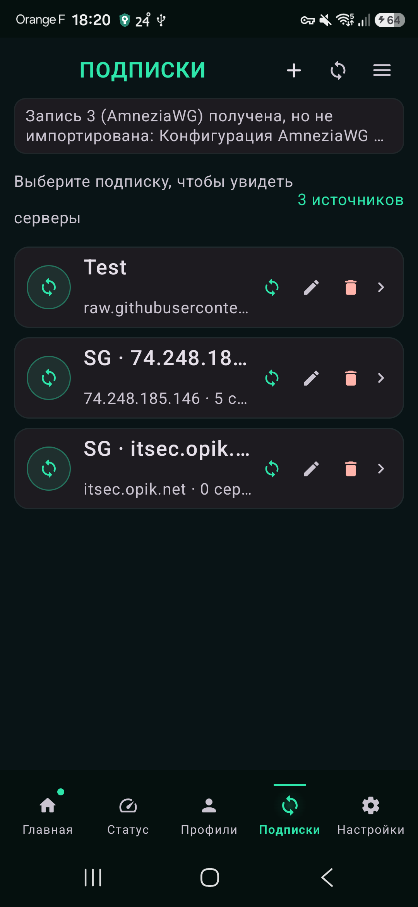</a>
  <a href="docs/screenshots/06-subscription-nodes.png">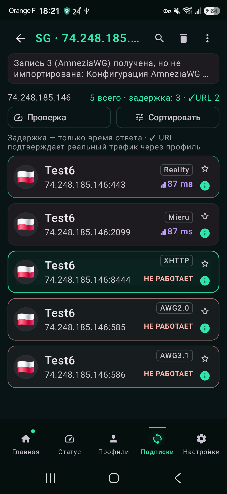</a>
  <a href="docs/screenshots/07-traffic-15min.png">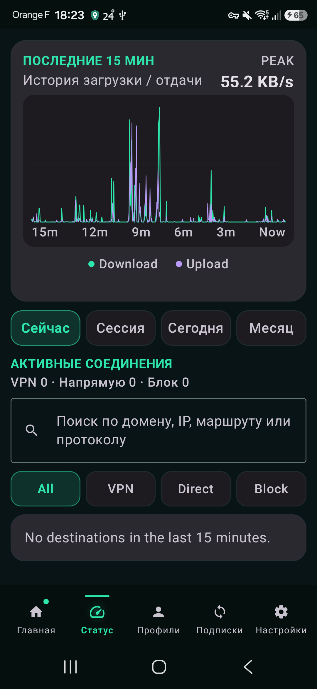</a>
  <a href="docs/screenshots/07-traffic-statistics.png">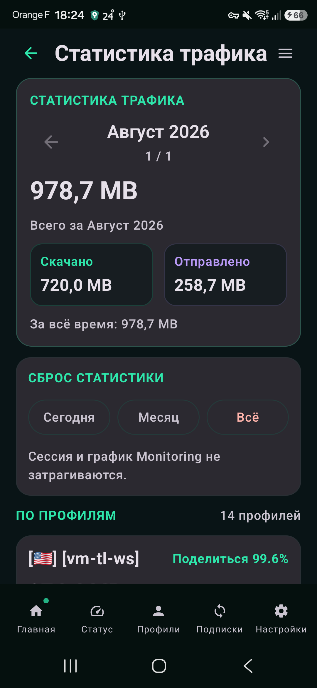</a>
</p>

<p align="center">
  <a href="docs/screenshots/08-routing.png">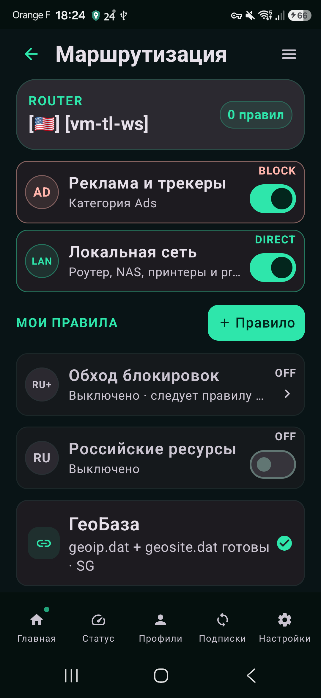</a>
  <a href="docs/screenshots/09-per-app.png">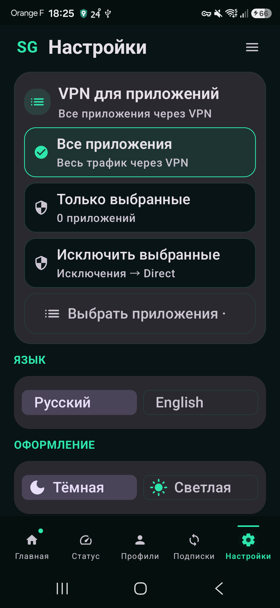</a>
  <a href="docs/screenshots/10-leak-protection.png">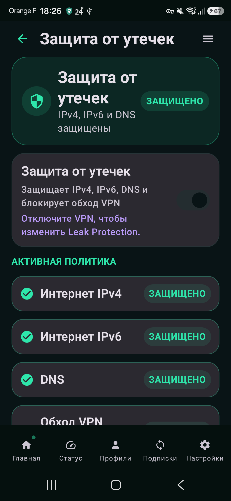</a>
</p>

<p align="center">
  <a href="docs/screenshots/10-settings-battery-autorotate.png">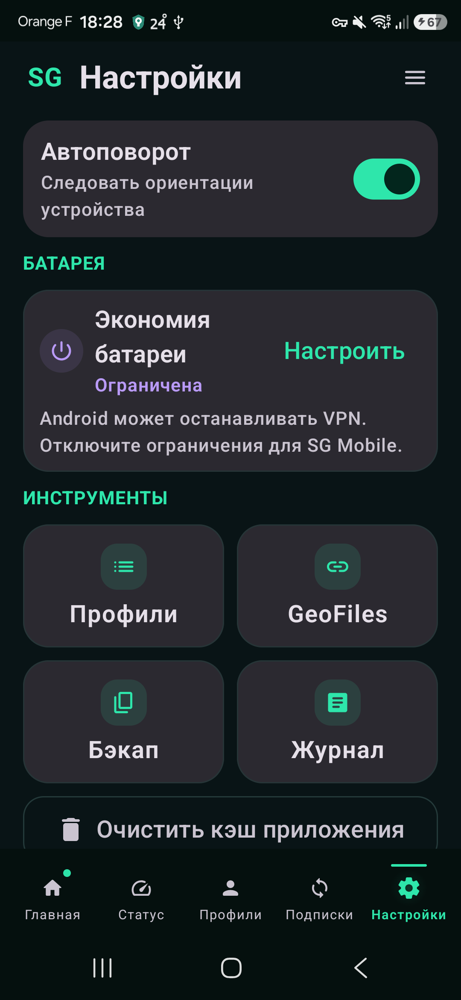</a>
  <a href="docs/screenshots/11-backup.png">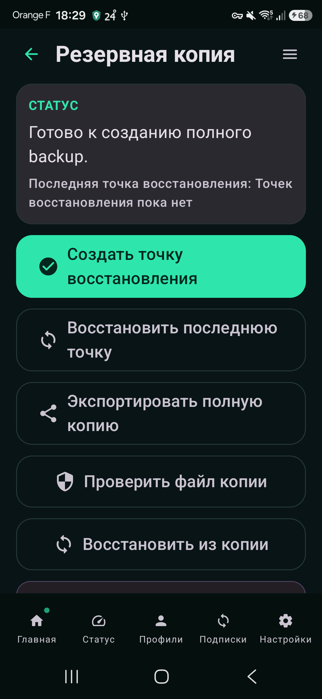</a>
  <a href="docs/screenshots/12-diagnostics.png">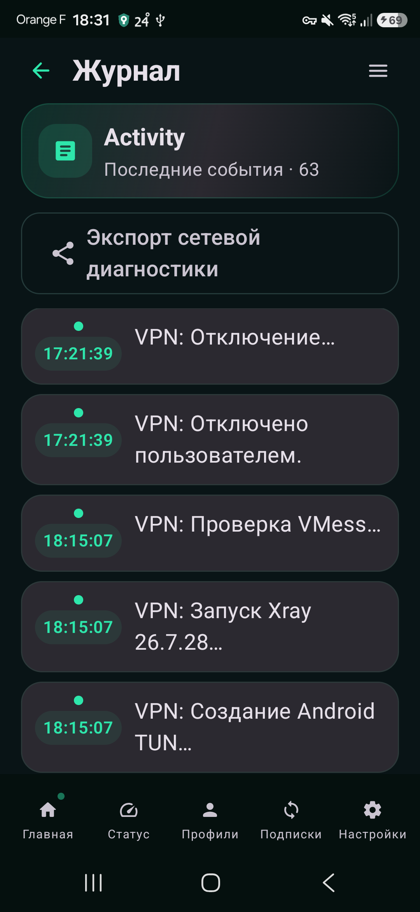</a>
</p>

Полный список экранов и правила подготовки снимков находятся в [разделе скриншотов](docs/screenshots/README.md).

## Проверка APK

Проверяйте контрольную сумму полной командой.

Windows PowerShell:

```powershell
Get-FileHash .\SG-Mobile.apk -Algorithm SHA256
```

Linux:

```bash
sha256sum SG-Mobile.apk
```

macOS:

```bash
shasum -a 256 SG-Mobile.apk
```

Совпасть должна вся строка SHA-256.

## Сообщение об ошибке

Перед отчётом подготовьте:

- модель телефона;
- версию Android и оболочки;
- версию SG Mobile и versionCode;
- используемый протокол;
- тип сети: Wi-Fi, LTE или 5G;
- точные шаги воспроизведения;
- ожидаемый и фактический результат;
- время возникновения ошибки;
- очищенный фрагмент журнала.

Не публикуйте конфигурацию, резервную копию или журнал без предварительной проверки. Подробный порядок находится в [SUPPORT.md](SUPPORT.md), а правила очистки данных — в [SECURITY.md](SECURITY.md).

## Текущий статус

Документация соответствует тестовой линии SG Mobile 074P:

- Android 8.0 и новее;
- архитектура arm64-v8a;
- versionCode 193;
- versionName `0.0.93-help-entry`;
- русская автономная справка;
- отдельные профили AWG 2.0, AWG 3.0 и AWG 3.1.

Наличие документации не означает, что APK уже опубликован. Готовая сборка считается доступной только после появления отдельного GitHub Release с APK и SHA-256.

## Лицензии

SG Mobile использует сторонние сетевые движки и библиотеки с собственными лицензиями. Перечень компонентов и зафиксированные версии приведены в [THIRD-PARTY-NOTICES.md](THIRD-PARTY-NOTICES.md).

Условия распространения самого SG Mobile будут опубликованы отдельно. Отсутствие файла LICENSE в этом репозитории не означает передачу прав на приложение или его материалы.
